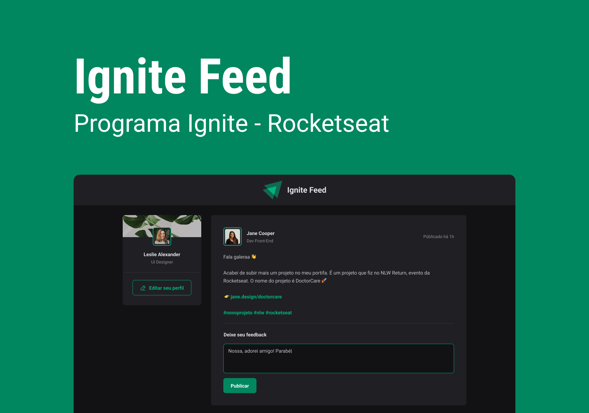

# ignite Feed - React fundamentals (Ignite)

<div>
  
  
  
</div>


> First project of Ignite's ReactJs track.


<br></br>

## 🧪 Technologies

This project was developed using the following technologies:

- [ReactJS](https://reactjs.org/)
- [TypeScript](https://www.typescriptlang.org/)
- [ViteJS](https://vitejs.dev/)
- [CSS](https://developer.mozilla.org/pt-BR/docs/Web/CSS)
- [Data-fns](https://date-fns.org/)
- [Phosphor-Icons](https://phosphoricons.com/)

<br></br>

## 🚀 Getting started

Clone the project and access the folder.

```bash
$ git clone https://github.com/leticiar-io/ignite-feed.git
$ cd ignite-feed
```

Follow the steps below:

```bash
# Install the web dependencies
$ npm install
# Start the web project
$ npm run dev
```


[⬆ Back to top](#ignite-feed)<br>